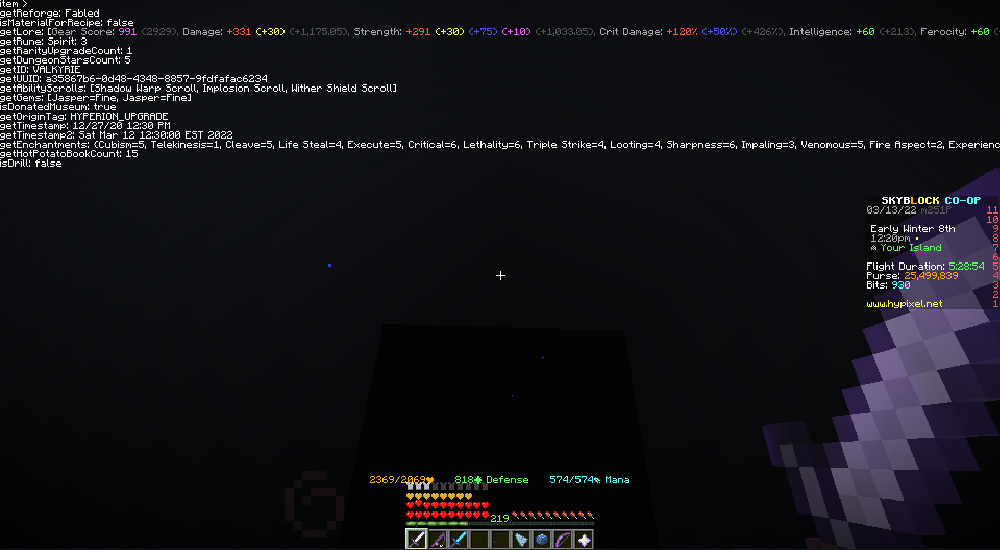

# libSkyblock
A library made for easy interactions with Hypixel Skyblock items, players and much more. Contains many useful objects, methods and utilities for extracting data and presenting it in a pretty data form. `Forge 1.8.9`. Currently in development.

## Importing
```groovy
repositories {
    maven { url "https://repo.dreamys.studio/" }
}
```

```groovy
dependencies {
    implementation "studio.dreamys:libSkyblock:1.1.1"
}
```

## SBItem
> Initialize the class by passing in an ItemStack like so:
```java
ItemStack stack = Minecraft.getMinecraft().thePlayer.getHeldItem();
SBItem i = new SBItem(stack);
//i.getReforge()
//...
```

## SBPlayer
> Initialize the class by passing in an EntityPlayer like so:
```java
EntityPlayer player = Minecraft.getMinecraft().thePlayer;
SBPlayer p = new SBPlayer(player);
//p.getPurse()
//...
```

## Demo
> Refer to [TestMod](https://github.com/DxxxxY/libSkyblock/blob/master/src/main/java/studio/dreamys/test/TestMod.java) for this demo.



## Credits
#### Some components/inspirations were taken from these open-source projects.

Software | License
------------ | -------------
[SkyblockAddons](https://github.com/BiscuitDevelopment/SkyblockAddons/) | [MIT License](https://github.com/BiscuitDevelopment/SkyblockAddons/blob/master/LICENSE)
[Danker's Skyblock Mod](https://github.com/bowser0000/SkyblockMod/) | [GPL-3.0 License](https://github.com/bowser0000/SkyblockMod/blob/master/LICENSE)
[Cowlection](https://github.com/cow-mc/Cowlection/) | [MIT License](https://github.com/cow-mc/Cowlection/blob/master/LICENSE)